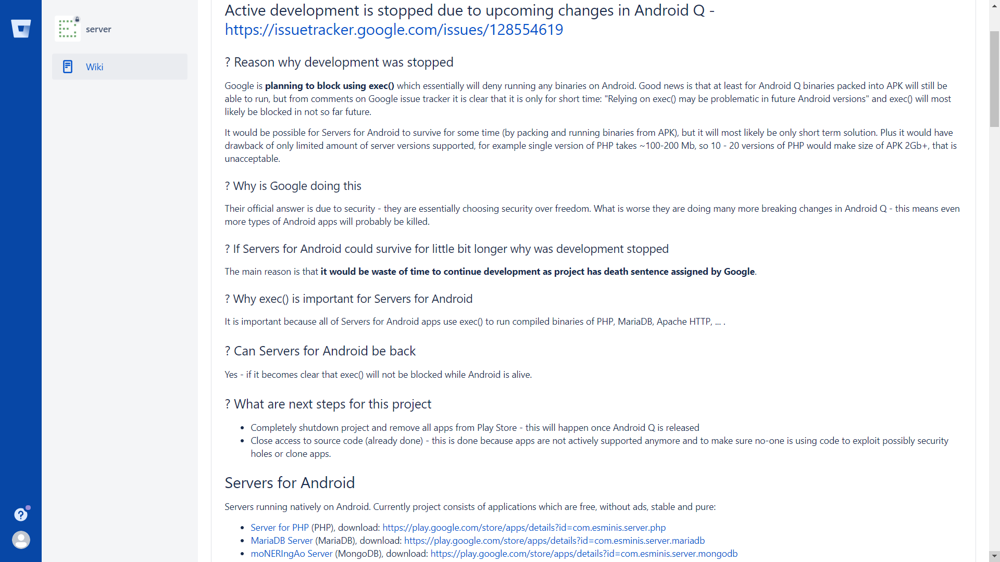
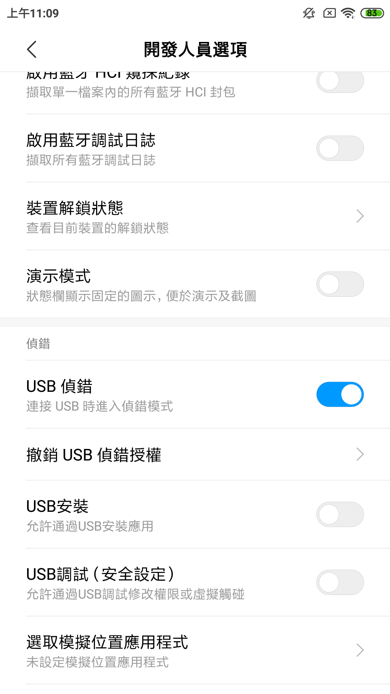
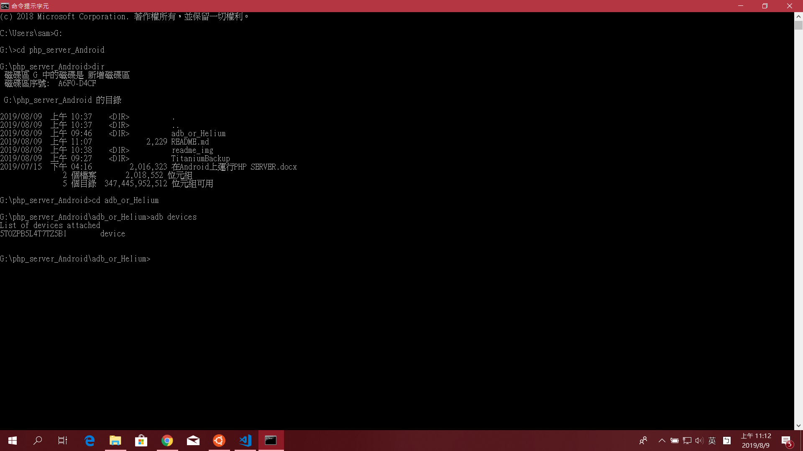
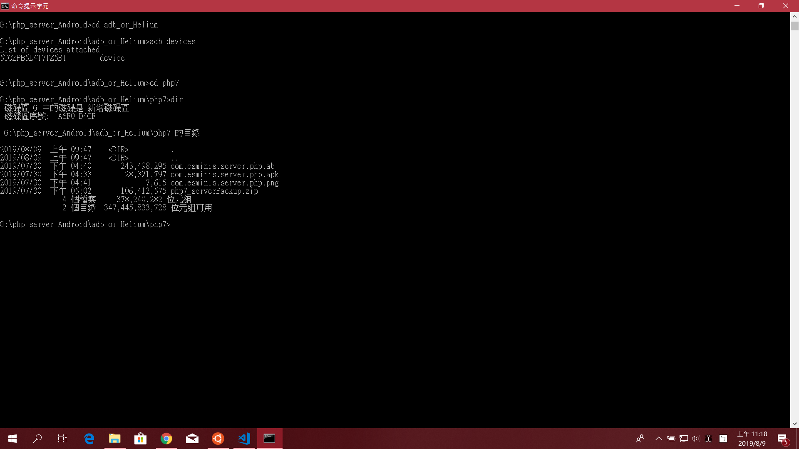
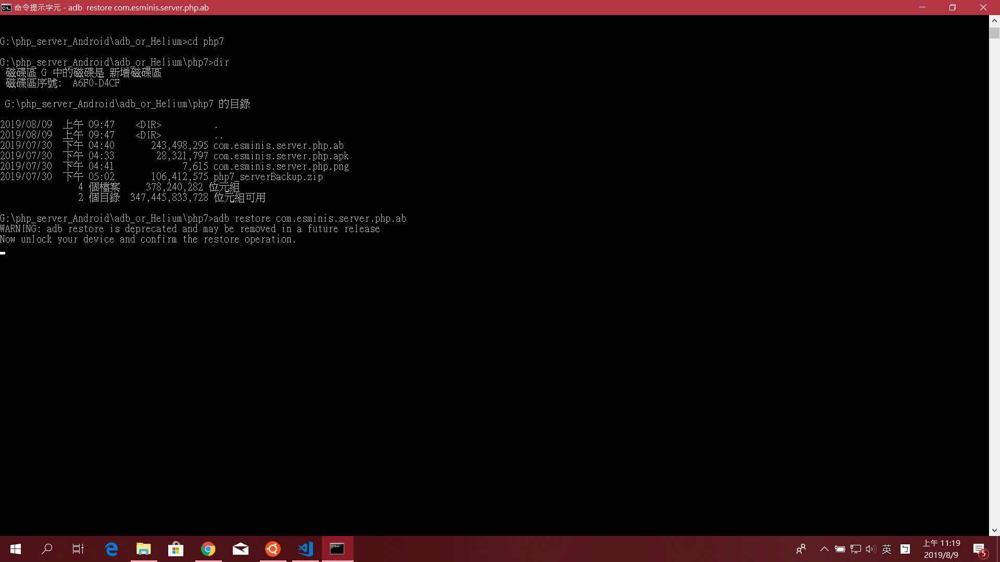
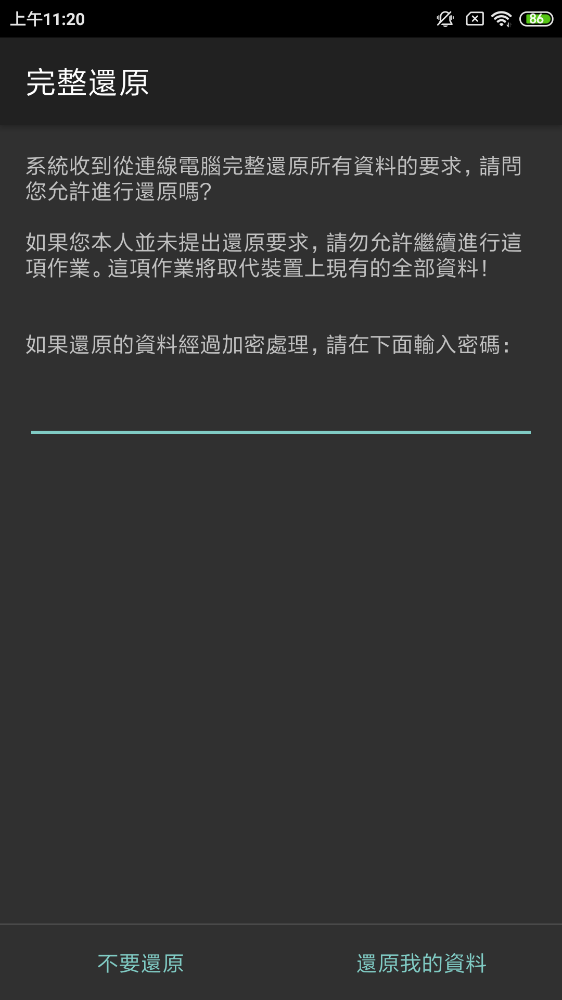

# PHP Server on Android

## Install the app
安裝軟體：[Server For PHP](https://play.google.com/store/apps/details?id=com.esminis.server.php&hl=zh_TW)

[According to the developer](https://bitbucket.org/esminis/server/wiki/Home), the app development is stopped due to policy change in Android Q(Android 10).

This application may be removed once Android Q released. 

The backup is done by using Helium or adb, the following tutorial will demostrate how to restore the Server For PHP.

根據Android Q的政策更新，Server For PHP這套軟體可能將在Andorid Q正式發行後下架。

對Server For PHP的備份已經完成，下列教程將提供您如何回朔。

---------------------------------------------------------

## Tutorial of Restoring Server For PHP 回復軟體教程

透過下列幾種方式回復app及其檔案：

運用adb：請先下載adb相關工具、驅動 [相關教程](http://blog.pulipuli.info/2019/01/adbfastbootandroid-sdk-platform-tools.html)

運用Helium Backup：號稱不需要Root權限中最強大的備份軟體。需要下載手機及電腦上的軟件。[相關教程](https://lbear.pixnet.net/blog/post/53918396-%E3%80%90helium-%E5%82%99%E4%BB%BD%E3%80%91%E7%84%A1%E7%97%9B%E8%BD%89%E7%A7%BB%E6%89%8B%E6%A9%9F---%E6%8E%A5%E8%BF%91%E5%AE%8C%E7%BE%8E%E7%9A%84%E8%B3%87)

運用鈦備份(需要Root權限)：[相關教程](https://kakasi5555.pixnet.net/blog/post/93044884-%E9%88%A6%E5%82%99%E4%BB%BD%E7%B0%A1%E5%96%AE%E5%82%99%E4%BB%BD%E9%82%84%E5%8E%9F%E6%95%99%E5%AD%B8%28%E9%99%90rooted%E4%BD%BF%E7%94%A8%E8%80%85%29)

原則上，使用adb及Helium Backup就能回溯Server For PHP。

*附註：值得注意的是，從Play Store下載下來的Server For PHP並不能備份。透過對apk解壓並修改其AndroidManifest的數值，讓Server For PHP可以進行備份。[相關教程](https://codecharge.com.tw/phpBB2/viewtopic.php?f=39&t=22570)

#

在github專案中有兩個資料夾，分別為：

供adb及Helium回復的adb_or_Helium資料夾，可以選擇php7或php5版本

供鈦備份回復的TitaniumBackup資料夾

#

這邊示範用adb回復檔案：

1.啟用手機中開發人員選項>>勾選"USB偵錯"，完成後連接電腦

2.安裝adb及驅動完成後，下載github上的專案。啟用終端機，輸入adb devices確認裝置接上

3.變更工作目錄至adb_or_Helium中，這次安裝php7版本，進入php7資料夾

4.指令 adb restore com.esminis.server.php.ab，此時cmd會提醒您將裝置解鎖

5. 此時解鎖裝置，並按下"還原我的資料"。注意：不需要輸入密碼！！！

6.還原完成

------------------------------------------------------------
## How to depoly Laravel on Server For PHP     如何使用

參照Docs"在Android上運行PHP SERVER"

-------------------------------------------------------------

